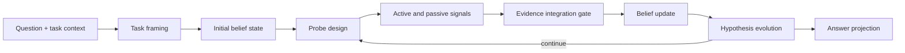

# BayesProbe

**A signal-grounded agent runtime for explicit belief revision over evolving hypotheses.**

BayesProbe is an engineering-first research project. Its primitive state is a
revisable **Belief State**, not a final answer, plan, or chain of thought. Active
tool results and passive observations enter as signals, pass through one
evidence gate, update the belief state, and are only then projected into a
task-facing answer.

> **中文简介：** BayesProbe 是一个以信念状态为核心的 Agent 工程项目。它不把
> ReAct、ReWOO 等范式嵌套进内部控制流，而是将外部信息统一建模为 Signal，经由
> Evidence Integration Gate 转化为 Evidence，再更新可修正的 Belief State。
> 当前仓库聚焦可运行 MVP、开放性问题、工程化运行时和可复现实验，而非纯理论论述。

> [!IMPORTANT]
> BayesProbe is a research MVP, not a production-ready agent framework. The
> epistemic kernel and open-question vertical slice are runnable; runtime
> cancellation, hard request deadlines, unified composition, and broader agent
> benchmarks still need engineering closure.

## Why BayesProbe?

Most agent loops organize work around actions, plans, or generated reasoning.
BayesProbe instead organizes the whole run around uncertainty:

1. Frame the task and create an initial hypothesis space.
2. Design probes that can discriminate among hypotheses.
3. Collect active and passive `ExternalSignal`s.
4. Judge signals through a single Evidence Integration Gate.
5. Update posterior belief and evolve an inadequate hypothesis space.
6. Project the current belief state into a practical answer.

ReAct, ReWOO, Tree of Thoughts, Graph of Thoughts, and Reflexion are comparison
paradigms, not internal BayesProbe execution layers.



## Current MVP

The repository currently includes:

- task admission and typed framing for multiple-choice, exact-answer, and open
  questions;
- model-generated hypotheses for open questions, including bounded expansion
  when the initial frame is inadequate;
- one signal-to-evidence path with schema-neutral failure handling;
- posterior belief updates, evidence memory, hypothesis evolution, and answer
  projection;
- autonomous self-loop and synchronized round-based runners;
- active probe execution plus passive human, agent, benchmark, or system input;
- deterministic, recorded, OpenAI Responses, and OpenAI-compatible Chat
  Completions model gateways;
- opt-in Tavily retrieval, where a probe plans a query, each returned URL enters
  as a `RETRIEVED_SOURCE` signal, and the evidence gate alone decides whether it
  can revise belief;
- a local WebUI with streamed run progress, belief state, evidence trail, and
  cycle trace;
- JSONL ledger, provider telemetry, benchmark artifacts, and a frozen HLE
  text-MCQ pilot pipeline;
- a public Python SDK with explicit runtime components.

BayesProbe does **not** yet provide a production-grade tool ecosystem, durable
distributed execution, a finished multi-agent protocol, or a validated coding
agent. SWE-bench, Terminal-Bench, and RE-Bench are future validation targets.

### Tavily Search Matrix

The search experiment compares the frozen no-web checkpoint with two new,
equal-budget arms: `direct_search` and `bayesprobe_search`. Set provider and
Tavily credentials only as environment variables, then run:

```bash
export TAVILY_API_KEY='...'
python -m bayesprobe eval search-prepare --config configs/hle-pilot-v0.1.json --source-checkpoint /path/to/checkpoint
python -m bayesprobe eval search-run --experiment /path/to/prepared-search-matrix
python -m bayesprobe eval search-score --experiment /path/to/prepared-search-matrix
python -m bayesprobe eval search-report --experiment /path/to/prepared-search-matrix
```

Each arm has at most two Tavily `advanced` calls per case. Search failures and
empty results do not fall back to model-reasoning signals; they are recorded as
treatment-not-delivered cases. Reports contain only aggregates, never questions,
retrieved URLs, snippets, or credentials.

## Quick Start

### Requirements

- Python 3.11 or newer
- A model API key for provider-backed runs
- Node.js only for the WebUI JavaScript tests
- Docker only for the Python-augmented HLE pilot

### Install

```bash
git clone https://github.com/dengjianbo3/bayesprobe.git
cd bayesprobe
python -m venv .venv
source .venv/bin/activate
python -m pip install -e ".[dev,openai]"
```

Add the HLE dataset dependencies only when running that evaluation pipeline:

```bash
python -m pip install -e ".[dev,openai,hle]"
```

### Run the WebUI

```bash
python -m bayesprobe.webui --host 127.0.0.1 --port 8768
```

Open [http://127.0.0.1:8768](http://127.0.0.1:8768). The WebUI supports:

- local deterministic smoke runs;
- OpenAI Responses providers;
- generic OpenAI-compatible `/chat/completions` providers;
- autonomous cycle and probe limits;
- live framing, signal, evidence, belief, and answer-projection progress.

For an OpenAI-compatible provider, select **Chat Completions** and enter the
provider's base URL, model name, and API key. Provider credentials are request
inputs and must never be committed to repository configuration.

The **Question** field is the task to solve. **Task context** contains scope,
constraints, audience, or output requirements. **Initial signal** contains an
observation, source passage, log, or expert feedback that should enter the first
cycle as external information.

## Python SDK

The package exposes the core, runners, framing services, gateways, schemas, and
projection interfaces from `bayesprobe`:

```python
from bayesprobe import (
    AutonomousQuestionRunner,
    BayesProbeCore,
    BayesProbeInitializer,
    InitializeRunInput,
    OpenAIChatCompletionsModelGateway,
    SynchronizedRoundRunner,
)
```

Runtime composition is currently explicit so experiments can replace model,
probe, ledger, framing, and projection adapters independently. See
[`tests/test_question_runner.py`](tests/test_question_runner.py) for autonomous
composition examples and [`tests/test_synchronized_runner.py`](tests/test_synchronized_runner.py)
for synchronized execution examples. A smaller unified runtime factory remains
planned work.

## CLI and Evaluation

Inspect the available commands:

```bash
bayesprobe --help
bayesprobe eval --help
```

Run a JSON-configured local benchmark experiment:

```bash
bayesprobe run --config path/to/experiment.json
```

The frozen HLE text-MCQ capability pipeline has four explicit phases:

```bash
bayesprobe eval prepare --config configs/hle-pilot-v0.1.json
bayesprobe eval run --config configs/hle-pilot-v0.1.json
bayesprobe eval score --experiment artifacts/restricted/<experiment-id>
bayesprobe eval report --experiment artifacts/restricted/<experiment-id>
```

Before a formal run, copy
[`configs/hle-pilot-v0.1.example.json`](configs/hle-pilot-v0.1.example.json), pin
the dataset revision and pricing snapshot, configure an environment-variable
name for the provider key, and verify Docker sandbox availability. HLE source
items, gold answers, raw model outputs, and credentials belong in restricted
artifacts and must not be committed.

## Experimental Status

A July 2026 exploratory HLE pilot compared DeepSeek v4 Flash directly against
the BayesProbe Python-augmented arm. The run was deliberately stopped before
completion, so it is **not an official HLE score**.

On 77 completed paired cases:

| Arm | Correct | Accuracy |
| --- | ---: | ---: |
| Direct model | 15 / 77 | 19.48% |
| BayesProbe | 14 / 77 | 18.18% |

BayesProbe-only wins occurred on five cases and direct-only wins on six. The
observed difference was not statistically meaningful in this truncated sample.
The useful result is narrower: BayesProbe measurably changes model behavior and
produces inspectable epistemic traces, but this pilot did not establish an
accuracy advantage. Longer loops also did not show an early recovery signal and
were much more expensive.

## Architecture

The main runtime boundary is between a run-regime controller and the epistemic
core:

- runners own timing, waiting, active probing, passive intake, and stopping;
- the core owns evidence judgment, posterior update, hypothesis evolution, and
  ledger-visible cycle integration;
- adapters own model providers, tools, storage, datasets, and reports.

Read [`docs/ARCHITECTURE.md`](docs/ARCHITECTURE.md) for the complete target
architecture, implementation map, invariants, and known gaps.

Key repository paths:

| Path | Purpose |
| --- | --- |
| [`bayesprobe/core.py`](bayesprobe/core.py) | Signal integration and epistemic cycle kernel |
| [`bayesprobe/question_runner.py`](bayesprobe/question_runner.py) | Autonomous question loop |
| [`bayesprobe/synchronized_runner.py`](bayesprobe/synchronized_runner.py) | Externally synchronized rounds |
| [`bayesprobe/task_framing.py`](bayesprobe/task_framing.py) | Typed task and hypothesis framing |
| [`bayesprobe/openai_gateway.py`](bayesprobe/openai_gateway.py) | Responses and Chat Completions adapters |
| [`bayesprobe/webui.py`](bayesprobe/webui.py) | Local WebUI server and request composition |
| [`bayesprobe/evaluation/`](bayesprobe/evaluation/) | Frozen capability experiment pipeline |
| [`tests/`](tests/) | Unit, integration, fixture, and WebUI behavior tests |

## Development

Run the Python suite:

```bash
python -m pytest
```

Run the WebUI JavaScript behavior suite:

```bash
node --test tests/test_webui_stream.js
```

Live provider tests are opt-in and require an explicit environment flag and API
key. Never place keys directly in JSON files, source code, test fixtures, shell
history intended for sharing, or Git commits.

## Roadmap

The next engineering milestone is runtime reliability closure:

1. enforce closed hypothesis-space constraints inside the core;
2. make evaluation autonomy settings control the actual runner;
3. add hard provider deadlines, cancellation, checkpointing, and resume states;
4. unify WebUI, SDK, and evaluation composition behind one runtime interface;
5. run preregistered loop-depth ablations before larger public benchmarks.

After that, validation shifts toward agent tasks where active investigation and
stateful revision matter: SWE-bench, Terminal-Bench, and RE-Bench.

## Documentation

- [`docs/ARCHITECTURE.md`](docs/ARCHITECTURE.md): living architecture and
  implementation status
- [`docs/BayesProbe_01_paradigm_v0.2_outline.md`](docs/BayesProbe_01_paradigm_v0.2_outline.md):
  paradigm and conceptual commitments
- [`docs/BayesProbe_02_engineering_v0.2_outline.md`](docs/BayesProbe_02_engineering_v0.2_outline.md):
  engineering guidance
- [`docs/BayesProbe_03_benchmark_v0.2_outline.md`](docs/BayesProbe_03_benchmark_v0.2_outline.md):
  experiment and benchmark direction
- [`docs/BayesProbe_engineering_design_v0.2.md`](docs/BayesProbe_engineering_design_v0.2.md):
  detailed engineering design

## Project Status

BayesProbe is under active research and development. Interfaces, schemas, and
experiment protocols may change while the MVP is being closed. Issues and
reproducible experiment reports are welcome; claims of method superiority should
include paired baselines, failure denominators, frozen configurations, and
shareable provenance.
